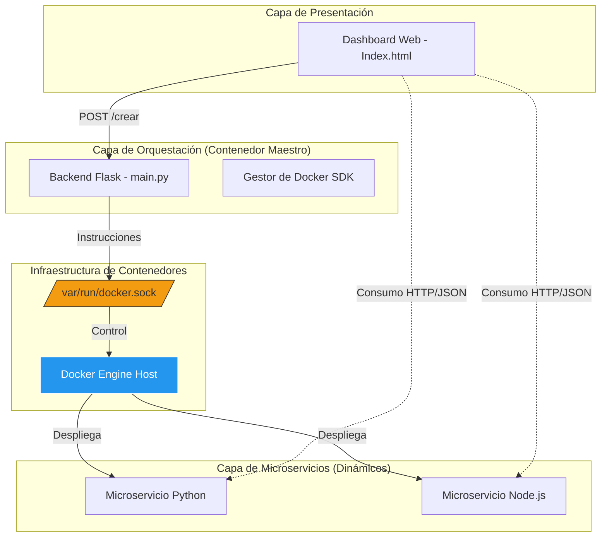

# 🚀 Plataforma de Gestión Dinámica de Microservicios

## 📝 Descripción
Esta plataforma es una solución integral para la **orquestación dinámica de microservicios** basada en contenedores. El sistema permite que un desarrollador pase de tener código fuente "plano" a un microservicio productivo en segundos, sin configuración manual de infraestructura.

### ¿Qué define a nuestros microservicios?
Siguiendo los lineamientos del proyecto, cada servicio creado en esta plataforma es:
* **Independiente:** Posee su propio entorno de ejecución y sistema de archivos.
* **Contenerizado:** Se encapsula en una imagen Docker única basada en entornos `slim` o `alpine` para optimizar recursos.
* **Accesible:** Expone un endpoint HTTP dedicado que procesa datos y responde exclusivamente en formato **JSON**.
* **Evolutivo:** No están predefinidos; la plataforma los construye desde cero según la demanda del usuario.

## Arquitectura de la Solución
El sistema implementa un modelo **DooD (Docker-out-of-Docker)**. El orquestador principal (Flask) se comunica directamente con el **Docker Engine** del host mediante el montaje del socket de Unix.


 
## Integrantes
* BRITO ROCA, SEBASTIAN
* BUELVAS IRIARTE, MIKE
* MUNDELL ZAPATA, HERNAN
* SIACHOQUE FERNANDEZ, EMANUEL

## Requisitos e Instalación
1. Tener **Docker Desktop** abierto.
2. Clonar este repositorio.
3. Ejecutar en la terminal:
   ```bash
   docker-compose up --build
4. Abrir en el navegador: [http://localhost:3000](http://localhost:3000)

## 📖 Ejemplos para Probar (Copiar y Pegar)
1. Hola Mundo
 * Python:
```python
   def hola(): return "Hola Mundo"
```
 * Node.js:
```javascript
   function hola() { return "Hola Mundo desde Node"; }
```
2. Suma de dos valores
 * Python:
```python
   def sumar():
    a = request.args.get('a', default=0, type=int)
    b = request.args.get('b', default=0, type=int)
    return {"resultado": a + b}
```
 * Node.js:
```javascript
   function sumar(a = 0, b = 0) {
    return { "resultado": Number(a) + Number(b) };
   }
```
## 💡 Tip de Uso: Generación con un solo clic
Si no deseas copiar y pegar manualmente los códigos anteriores, el Dashboard incluye una funcionalidad de ayuda rápida:

En la sección de creación, encontrarás los botones "hola" y "sumar".
Al presionarlos, el sistema rellenará automáticamente el campo de código para el lenguaje seleccionado.

## 🎥 Video de Demostración
[Link a YouTube aquí]


